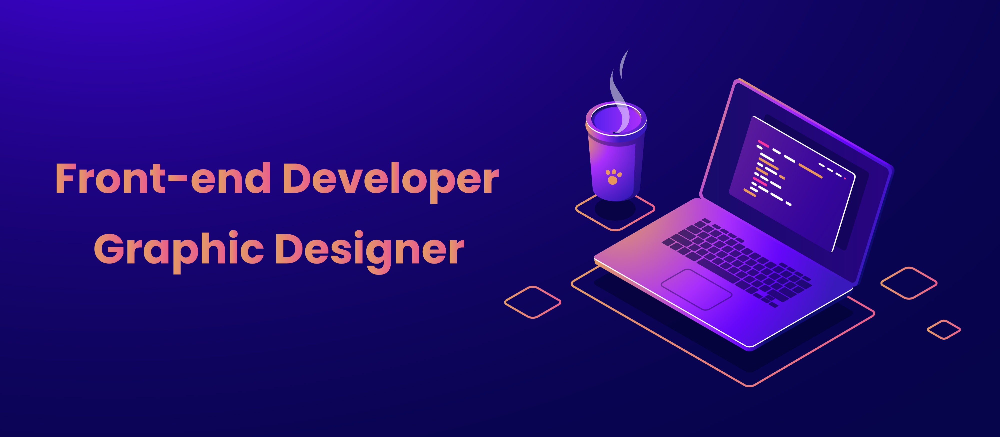

  

## Hello Folks👋

 
This is Jaspreet Singh Saini, a Second-year student pursuing BCA+MCA from Medi-Caps University. I'm a Graphic Designer, Ui Designer and Front-end Web Developer who like to create amazing designs.
 I have started this journey as a beginner & what I learned throughout is that what makes everything possible is consistency.
 Willingness to learn something new is the foremost aspect of this skill :)

 

## My Skill Set  

  

 
  
 

 
  
   
  
  
  
  

 

 

## Connect with me  

   

  

  
 

